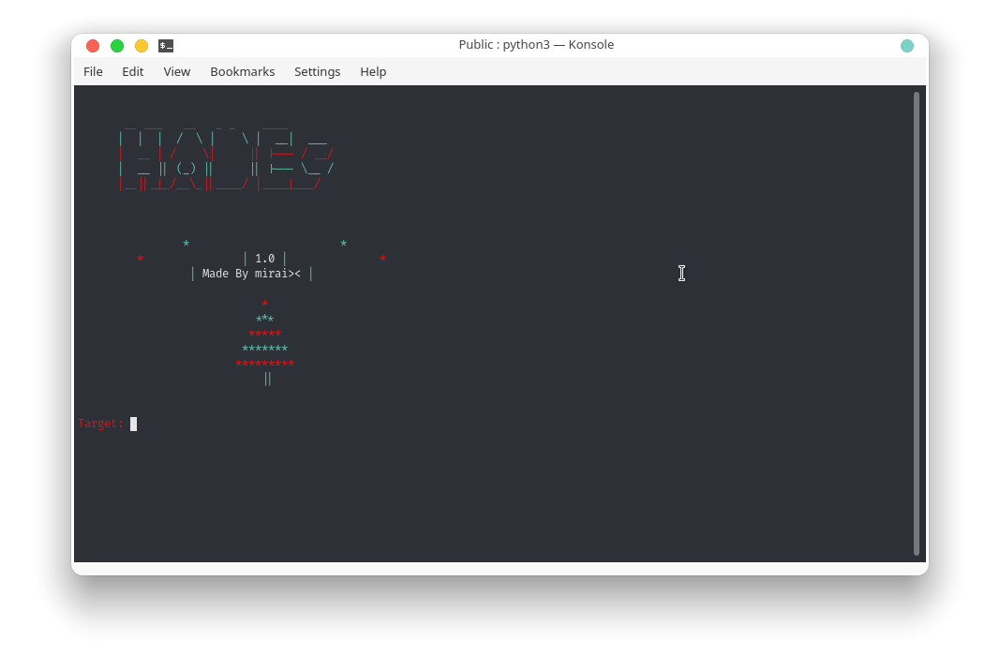

<h1>BETA</h1>

**HADES**
Advance scurity scanner for webserver vulnerabilities.

**Features Beta release:**
1. search for Cpanel
2. search for Sitemap
3. search for WordPress
4. Find WordPress plugins
5. Find SQL Injection and Local File Inclusion (LFI)

**features for official release:**

Remote File Inclusion (RFI)
CVE‑2010‑2088
Broken Authentication and Session Management
Insecure Direct Object References
Cross Site Request Forgery (CSRF)
Security Misconfiguration
Insecure Cryptographic Storage
Failure to restrict URL Access
Insufficient Transport Layer Protection
Unvalidated Redirects and Forwards
